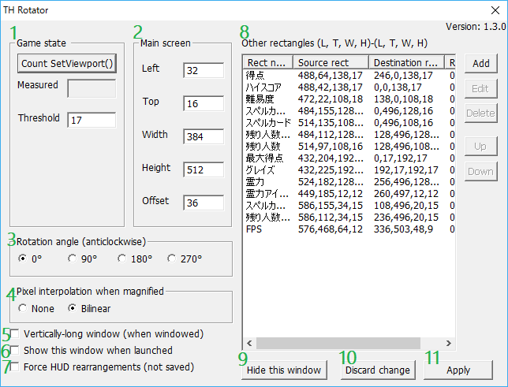
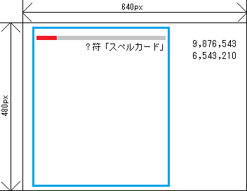

=====================
How to use
=====================

Rotate screen
=====================

By pressing ``Alt+Left`` or ``Alt+Right``, the screen is rotated by 90 degrees in left or right direction.
When entire screen aspect ratio, seen from rotated screen viewpoint, is smaller than the original,
THRotator tries to magnify main screen region to as large size as possible while you are playing or watching replay data.

Screen capture on Th06
========================================

THRotator allows to capture a screen into a .bmp file by pressing ``Home`` key on Th06,
which is unsupported on the original Th06.

The destination is ``snapshot`` folder in the installed directory,
which is the same as that since Th07 until Th12.

.. _usage_force_vertical:

Force HUD rearrangements
========================

HUD rearrangements for vertical screen are forced with ``Alt+Up`` and ``Alt+Down`` keys.
This option is useful when you want to manually switch to HUD arrangements for vertically-long screen.

THRotator detects whether you are playing or not by the criterion described in :ref:`usage_state_detection`.
If you would like to use THRotator on a newer Touhou Project game or a game other than Touhou Project
on which this detection methodology doesn't work,
use this feature or manipulate on the cutomization window, as described in :ref:`usage_ui_force_vertical`.

.. note:: This config is not saved to ``throt.ini`` due to its strong effect.

Customization window
=====================

Right click on the title bar, and click ``Show THRotator window`` or ``Open THRotator`` to show the customization window.
The customization window looks like as follows:

.. note::

   On Direct3D 9 version, the game proceeds as usual while this window is shown.
   On Direct3D 8 version, the game is suspended while this window is shown.

.. _usage_state_detection:

1. Game state
-----------------------

THRotator detects by counting setting viewport whether you are playing (we call it playing state) or not.
In Touhou Project, viewport is updated more frequently while playing state than otherwise.
THRotator exploits this fact to automatically switch to an HUD arrangement for vertically-long screen.

By clicking ``Count SetViewport()`` button, you can measure the number of times of setting viewport.
If number of times of setting viewport is more than the threshold, HUD elements are arranged for vertically-long screen.

If THRotator fails to read ``throt.ini``, the threshold is set to 999 by default to prevent unintentional switching.

If you would like to use THRotator on a newer Touhou Project game or a game other than Touhou Project
on which this detection methodology doesn't work,
follow :ref:`usage_force_vertical` or manipulate on the cutomization window, as described in :ref:`usage_ui_force_vertical`.

2. Main screen
-----------------------

Specifying main screen position and size (blue rectangle in the figure below).
This rectangle is moved to the center of window or of entire screen,
and magnified to fit to the client size of window or of entire screen,
keeping its aspect ratio fixed.

In most of Touhou Project games, its position and size are (left, top, width, height)=(32, 16, 384, 448).
Exceptionally,
the position and size are (left, top, width, height)=(128, 16, 384, 448)
in Shoot the Bullet (Th095), Fairy Wars (Th128), and other spin-off games.

This rectangle specified here doesn't have to correctly match the actual main screen rectangle.
In fact, some margin is introduced in .ini files for Fairy Wars (Th128) and Uwabami Breakers (alcostg)
to accommodate all the HUD elements.

Finally, ``Offset`` can be used to adjust vertical position.

Since Th14, you can choose a non-640x480 resolution.
In that case, specify position, width, and height in the coordinate scaled to 640x480.

3. Rotation angle
-----------------------

Although you can rotate a screen by ``Alt+Left`` and ``Alt+Right``,
this window can also be used to specify rotation angle.
The direction of rotation is counter-clockwise.

The default choice is 0 degrees.

4. Pixel interpolation when magnified
-------------------------------------

Specifying how pixel colors are interpolated when magnified.

The default choice is bilinear.

5. Vertically-long window
-------------------------

If checked, the window size becomes vertically-long by swapping its width and height.

This checkbox is unchecked by default.

6. Show this window when launched
-----------------------------------------

If checked, this window appears immediately after the game is launched.

This checkbox is unchecked by default.

.. note:: This option is unavailable on Direct3D 8 version since main game window and customization window are not coexistent.

.. _usage_ui_force_vertical:

7. Force HUD rearrangements
---------------------------

If checked, HUD rearrangements are forced.
This option can also be switched with ``Alt+Up`` and ``Alt+Down`` when the main window is focused on.

This checkbox is unchecked by default.

THRotator detects whether you are playing or not by the criterion described in :ref:`usage_state_detection`.
If you would like to use THRotator on a newer Touhou Project game or a game other than Touhou Project
on which this detection methodology doesn't work,
manipulate on this checkbox or follow :ref:`usage_force_vertical`.

.. note:: This config is not saved to ``throt.ini`` due to its strong effect.

8. Other rectangles
-------------------

Specifying source and destination rectangles other than main screen.
To create a new rectangle transfer, click ``Add`` button,
then rectangle editing window appears.
To edit an existing rectangle transfer, select the name of rectangle transfer and click ``Edit``,
then rectangle editing window appears.

Rectangles are transferred from top to bottom.
So the bottommost transfer is rendered in front of all the other transfers.

Coordinate system is as follows,
where Wp and Hp are width and height of main screen size that is fit to the aspect ratio inverted from the original.

.. image:: ../images/cs.png

Since 1.01, rectangle transfer destination can reach the remaining black stripe regions.

Since Th14, you can choose a non-640x480 resolution.
In that case, specify position, width, and height in the coordinate scaled to 640x480.

9. Hide this window
---------------------------

Closing this window.

10. Discard change
---------------------------

Resetting to the parameters when ``Apply`` was pressed last time.

11. Apply
---------------

Applying input parameters to actual rendering.
When successful, config file ``throt.ini`` is saved.

Best practices
-------------------

Although this page describes the detailed behavior,
it is much easier to understand the behavior by actually editing parameters.

Procedure to support a new product looks like as follows:

1. Measure times of setting viewport in playing state and non-playing state respectively,
   determine a value larger than that in non-playing state and smaller than or equal to that in playing state,
   and fill the threshold by that value.
   
   * Please measure this value while challenging a spell card since it generally becomes fewer.
   
2. Fill main screen position and size.
3. Add rectangle transfers for the scores, health, and other HUD elements.

