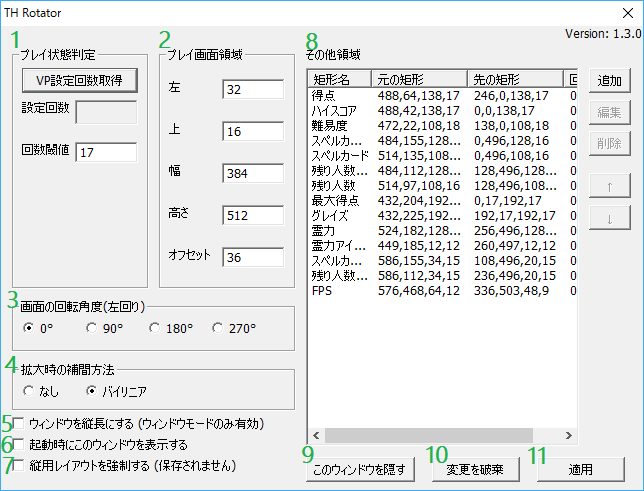

=====================
使い方
=====================

画面の回転
=====================

``Alt+左右キー`` を押すことで、それぞれ左方向、右方向に90度ずつ回転します。
また、プレイ時またはリプレイ再生時に、回転された画面から見てアスペクト比が本来よりも小さくなると、プレイ領域を画面目一杯に拡大します。 

東方紅魔郷でのスクリーンキャプチャ
========================================

東方紅魔郷にはスクリーンキャプチャが存在しませんが、THRotatorを使うことでスクリーンキャプチャを保存できるようになります。

``Homeキー`` でスクリーンキャプチャを行います。
保存先は、星蓮船までの作品と同じく、インストールディレクトリ以下の ``snapshot`` フォルダです。
ファイルフォーマットは ``.bmp`` です。 

縦用レイアウトの強制
========================

``Alt+上下キー`` により、縦用レイアウトを強制できます。
このオプションは、手動で縦用レイアウトにしたいときに便利です。

.. note:: この機能は影響が大きいため、 ``throt.ini`` に設定は保存されません。

カスタマイズ画面
=====================

ウィンドウモードでタイトルバーを右クリックし、メニューの1番下の ``THRotatorを表示`` をクリックすると、次のような画面が表示されます。

.. note:: Direct3D 9版はこのウィンドウを表示中でもゲームが進行しますが、Direct3D 8版はこの画面が出ている間はゲームが停止します。

1. プレイ状態の判定
---------------------

本ツールでは、現在プレイ中またはリプレイ再生中かどうかを判定するためのパラメータとして、1フレームあたりのVP(=ビューポート)設定回数の閾値を用います。
VP設定回数は、メニュー表示時などの本編をプレイしていない状態に比べ、プレイ時やリプレイ再生時のほうが多いため、このような判定方法を用いています。

VP設定回数が回数閾値を超えた場合、縦画面化のレイアウトを使ったほうが大きく表示できると判断された場合に限り、 縦画面用のレイアウトになります。

VP設定回数取得ボタンで、1フレーム間の実際のVP設定回数を取得できます。
回数閾値の欄に、本編をプレイしているときのVP設定回数以下、そうでないときのVP設定回数よりも大きい値を入力することで、
本編プレイ時に縦画面用のレイアウトになるように設定することができます。

``throt.ini`` が読み込めない場合は、意図せず縦画面用のレイアウトになるのを防ぐため、デフォルト値は999です。

2. プレイ画面領域
-----------------------

プレイ画面の矩形の位置、大きさを指定します(下図青枠の部分)。ここで指定した矩形が画面いっぱいにアスペクト比を保存しながら拡大され、画面の中央に配置されます。
東方プロジェクトの多くの作品では、(左,上,幅,高さ)=(32,16,384,448)、
文花帖や妖精大戦争のように真ん中に配置されている場合は(128,16,384,448)です。

.. image:: ../images/pr.png

しかし、ここで指定した矩形は実際のプレイ領域と同じである必要はありません。
妖精大戦争と黄昏酒場のデフォルトレイアウトのように、広めに取ることができます。

オフセットは画面が拡大された後にどれだけy方向に移動させるかを指定します。

輝針城以降の作品のように解像度が640x480ではない場合は、
画面を640x480に縮小した後の位置と幅を入力します。

3. 画面の回転角度
-----------------------

画面の回転は ``Alt+左右キー`` ですることができますが、この画面でも回転角を指定することができます。
回転方向は、左回り(反時計回り)です。

デフォルトは0°です。

4. 拡大時の補間方法
-----------------------

画像の拡大が行われた時の補間方法を指定します。

デフォルトはバイリニアです。

5. ウィンドウを縦長にする
-------------------------

ウィンドウモード時にチェックを入れておくと、ウィンドウの幅と高さを交換して縦長になります。

デフォルトではチェックされていません。

6. 起動時にTHRotatorの画面を出す
-----------------------------------------

起動時にTHRotatorの画面を出すかどうかを指定します。

デフォルトではチェックされていません。

.. note:: このオプションはDirect3D 8版では無効です。

7. 縦用レイアウトを強制する
----------------------------------

プレイ中とは判定されていない間でも、縦用レイアウトを強瀬宇するかどうかを指定します。
この設定は、メインウィンドウがフォーカスされているときに ``Alt+上下キー`` でも行うことができます。

デフォルトではチェックされていません。

.. note:: この機能は影響が大きいため、 ``throt.ini`` に設定は保存されません。

8. その他領域
----------------

プレイ領域以外の矩形の転送元矩形、転送先矩形の位置、大きさを指定します。
追加、またはリストから矩形を選択して編集すると矩形編集画面が表示されます。

矩形の転送は、上から順番に行われます。
そのため、リストの一番下にある矩形が最も上に描画されます。

転送先の座標系は、プレイ領域のサイズを、本来の逆数のアスペクト比に合わせた幅と高さをWp,Hpとして、次のようになります。

.. image:: ../images/cs.png

また、ver. 1.01から拡大して余った黒帯の領域にも矩形の転送ができるようになりました。

輝針城以降の作品のように解像度が640x480ではない場合は、
画面を640x480に縮小した後の位置と幅を入力します。

9. このウィンドウを隠す
---------------------------

右上の閉じるボタンと同じくTHRotatorの画面を閉じます。

10. 変更を破棄
---------------------------

最後に適用を押したときの状態に、フォームへの入力を戻します。

11. 適用
---------------

この画面で入力されたパラメータを実際に反映させます。このボタンを押したタイミングで設定ファイル ``throt.ini`` が保存されます。

ベストプラクティス
-------------------

以上長々と説明しましたが、パラメータを実際に変えてみて、どのようになるかを見たほうが、理解しやすいかもしれません。 
新作への対応の要領ですが、おおむね次のようになります。

1. 非プレイ時とプレイ時のVP設定回数を取得して、非プレイ時よりも大きく、プレイ時以下の値を回数閾値に入力する。
2. プレイ画面領域の位置とサイズを入力する。
3. スコアなどの情報を表示するために、その他領域に矩形を追加する。

